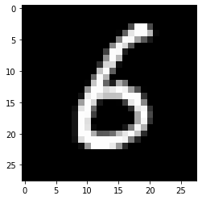
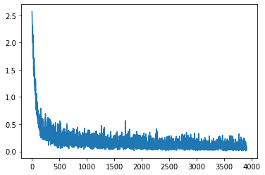
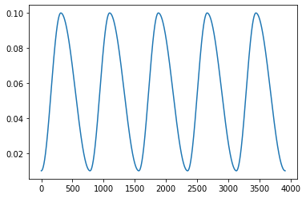

<!--

#################################################
### THIS FILE WAS AUTOGENERATED! DO NOT EDIT! ###
#################################################
# file to edit: index.ipynb
# command to build the docs after a change: nbdev_build_docs

-->

# Modern Architectures from Scratch

> Recreating recent and notable deep learning architectures from scratch using only built in python functionality. No PyTorch or Tensorflow (except for the tensor class from PyTorch). Nothing else was used (not even gradient calculations (AutoGrad) or modules)


## How to Use

Import desired modules:
```python
from ModernArchitecturesFromScratch.basic_operations_01 import *
from ModernArchitecturesFromScratch.fully_connected_network_02 import *
from ModernArchitecturesFromScratch.model_training_03 import *
from ModernArchitecturesFromScratch.convolutions_pooling_04 import *
from ModernArchitecturesFromScratch.callbacks_05 import *
from ModernArchitecturesFromScratch.batchnorm_06 import *
from ModernArchitecturesFromScratch.optimizers_07 import *
```
a full list of functions, classes and features defined in this API can be found here: https://bradleybrown19.github.io/ModernArchitecturesFromScratch/! Please see the tab on the left for a description of each imported module

Feel free to look at either the exported python files or the notebooks used to develop them!

# Examples

## Training a Fully Connected Model on MNIST

Getting model, loss function and databunch
<div class="codecell" markdown="1">
<div class="input_area" markdown="1">

```python
model = SequentialModel(Linear(784, 50, relu_after=True), ReLU(), Linear(50,10,False))
loss_func = CrossEntropy()
db = get_mnist_databunch()
model
```

</div>
<div class="output_area" markdown="1">


    (Layer1): Linear(784, 50)
    (Layer2): ReLU()
    (Layer3): Linear(50, 10)


</div>

</div>
<div class="codecell" markdown="1">
<div class="input_area" markdown="1">

```python
show_im(db.train_ds.x)
```

</div>
<div class="output_area" markdown="1">





</div>

</div>

Creating a learning rate scheduler and passing desired callbacks into `Runner` class
<div class="codecell" markdown="1">
<div class="input_area" markdown="1">

```python
schedule = combine_scheds([0.4, 0.6], [cos_scheduler(0.01,0.1), cos_scheduler(0.1,0.01)])
```

</div>

</div>
<div class="codecell" markdown="1">
<div class="input_area" markdown="1">

```python
run = get_runner(model=model, lf=loss_func, db=db, opt=StatedOptimizer, 
                 callbacks=[Stats([accuracy]), ProgressCallback(), HyperRecorder('lr'), Scheduler('lr', schedule)])
```

</div>

</div>

Fitting the model and looking at metrics
<div class="codecell" markdown="1">
<div class="input_area" markdown="1">

```python
run.fit(5, 0.1)
```

</div>
<div class="output_area" markdown="1">


<table border="1" class="dataframe">
  <thead>
    <tr style="text-align: left;">
      <th>epoch</th>
      <th>train_loss</th>
      <th>train_accuracy</th>
      <th>valid_loss</th>
      <th>valid_accuracy</th>
      <th>time</th>
    </tr>
  </thead>
  <tbody>
    <tr>
      <td>0</td>
      <td>0.431567</td>
      <td>0.870520</td>
      <td>0.184491</td>
      <td>0.946840</td>
      <td>00:01</td>
    </tr>
    <tr>
      <td>1</td>
      <td>0.175159</td>
      <td>0.948120</td>
      <td>0.132627</td>
      <td>0.961500</td>
      <td>00:01</td>
    </tr>
    <tr>
      <td>2</td>
      <td>0.134197</td>
      <td>0.960060</td>
      <td>0.105048</td>
      <td>0.970180</td>
      <td>00:01</td>
    </tr>
    <tr>
      <td>3</td>
      <td>0.110969</td>
      <td>0.967400</td>
      <td>0.087220</td>
      <td>0.975720</td>
      <td>00:01</td>
    </tr>
    <tr>
      <td>4</td>
      <td>0.095547</td>
      <td>0.972800</td>
      <td>0.075881</td>
      <td>0.978820</td>
      <td>00:01</td>
    </tr>
  </tbody>
</table>


</div>

</div>
<div class="codecell" markdown="1">
<div class="input_area" markdown="1">

```python
run.cbs[3].plot_loss()
```

</div>
<div class="output_area" markdown="1">





</div>

</div>
<div class="codecell" markdown="1">
<div class="input_area" markdown="1">

```python
run.cbs[3].plot_param('lr')
```

</div>
<div class="output_area" markdown="1">





</div>

</div>

## Creating a ResNet Model
<div class="codecell" markdown="1">
<div class="input_area" markdown="1">

```python
resnet = GetResnet(50, c_in=1, c_out=10)
```

</div>

</div>
<div class="codecell" markdown="1">
<div class="input_area" markdown="1">

```python
resnet
```

</div>
<div class="output_area" markdown="1">


    (Layer1): Reshape(1, 28, 28)
    (Layer2): ConvBnActivation(1, 16)
    (Layer3): ConvBnActivation(16, 64)
    (Layer4): ConvBnActivation(64, 64)
    (Layer5): MaxPool(ks: 3, stride: 2)
    (Layer6): (
    (Layer1): ResBlock(16, 256)
    (Layer2): ResBlock(64, 256)
    (Layer3): ResBlock(64, 256)
    )
    (Layer7): (
    (Layer1): ResBlock(64, 512)
    (Layer2): ResBlock(128, 512)
    (Layer3): ResBlock(128, 512)
    (Layer4): ResBlock(128, 512)
    )
    (Layer8): (
    (Layer1): ResBlock(128, 1024)
    (Layer2): ResBlock(256, 1024)
    (Layer3): ResBlock(256, 1024)
    (Layer4): ResBlock(256, 1024)
    (Layer5): ResBlock(256, 1024)
    (Layer6): ResBlock(256, 1024)
    )
    (Layer9): (
    (Layer1): ResBlock(256, 2048)
    (Layer2): ResBlock(512, 2048)
    (Layer3): ResBlock(512, 2048)
    )
    (Layer10): AveragePool(ks: 1, stride: 2)
    (Layer11): Flatten()
    (Layer12): Linear(2048, 10)


</div>

</div>

# Credits

A lot of this project was inspired and learned from FastAI's deep learning course part 2. Please see:
https://course.fast.ai/part2
for a great course!
